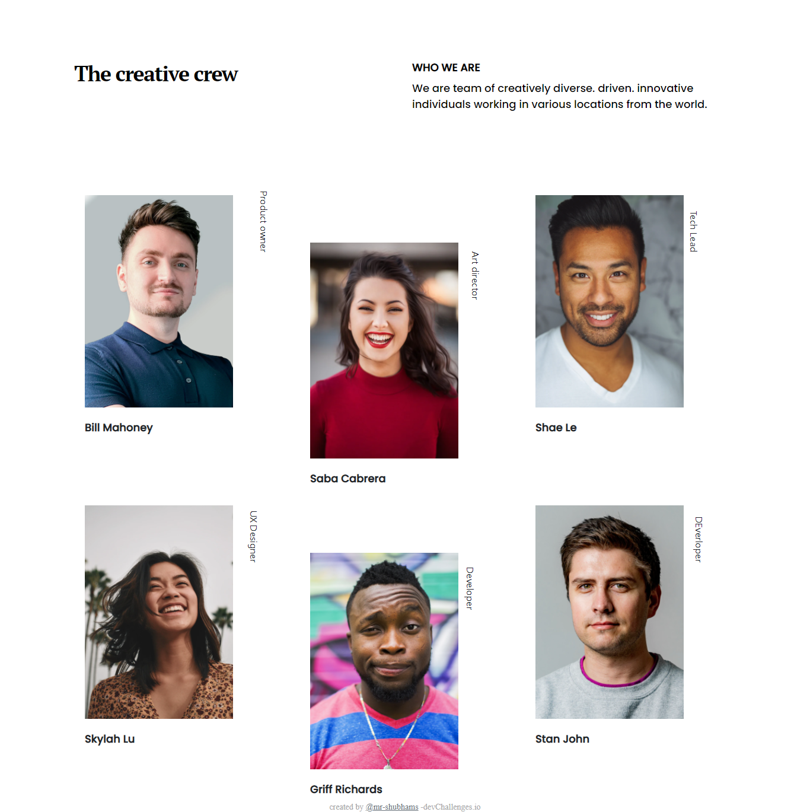
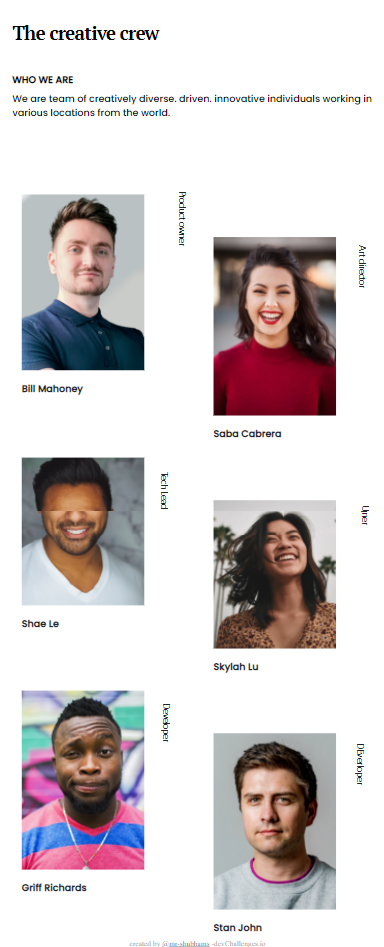

<!-- Please update value in the {}  -->

<h1 align="center">TEAM PAGE CHALLENGE</h1>

   Solution for a challenge from  <a href="http://devchallenges.io" target="_blank">Devchallenges.io</a>.

  <h3>
    <a href="https://https://mr-shubhams.github.io/team_page_challenge/team_page_challenge.html">
      Demo
    </a>
     | 
    <a href="https://https://github.com/mr-shubhams/team_page_challenge">
      Solution
    </a>
     | 
    <a href="https://devchallenges.io/challenges/hhmesazsqgKXrTkYkt0U">
      Challenge
    </a>
  </h3>

<!-- TABLE OF CONTENTS -->

## Table of Contents

- [Desktop view](#desktop-view)
- [Mobile view](#mobile-view)
- [Built With](#built-with)
- [Features](#features)
- [Contact](#contact)

<!-- OVERVIEW -->

## Desktop-view

## Mobile-view

- If you want to be see your demo <a href="https://github.com/mr-shubhams/team_page_challenge">click here</a>
- I'm beginner
- With the help of this i improved my text transformation skill and many more other skills.

### Built With

<!-- This section should list any major frameworks that you built your project using. Here are a few examples.-->

- [Bootstrap](https://bootstrap.com/)
- [HTML](https://html.com/)
- [CSS](https://css.com/)

## Features

<!-- List the features of your application or follow the template. Don't share the figma file here :) -->

This application/site was created as a submission to a [DevChallenges](https://devchallenges.io/challenges) challenge. The [challenge](https://devchallenges.io/challenges/wBunSb7FPrIepJZAg0sY) was to build an application to complete the given user stories.

## Contact

- GitHub [@mr-shubhams](https://github.com/mr-shubhams)
- Twitter [@mr_shubhams](https://twitter.com/mr_shubhams)
